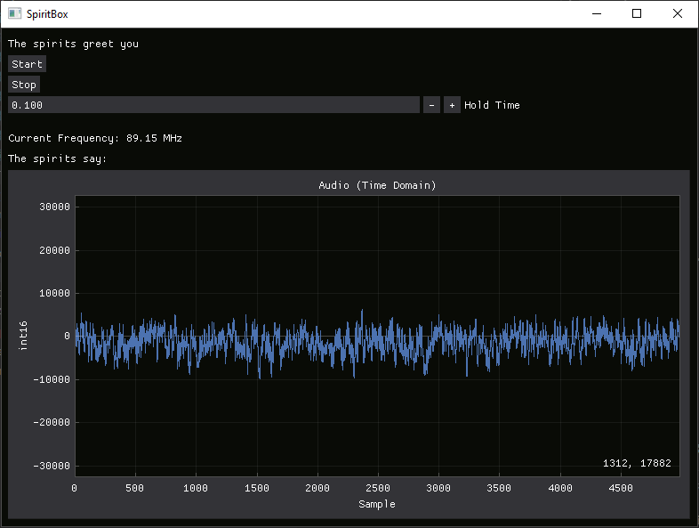

# PySpiritBox

<!-- screenshot -->


## Requirements
- Python 3.6+
- librtlsdr installed
- libusb installed
- RTL2832U USB Dongle

## Running 
Run the following command to start the program:
```
python3 spiritbox.py
```

It will run until you press Ctrl+C to stop it.

### GUI

To run the GUI, run the following command:
```
python3 gui.py
```

Right now, the gui is very basic, and only lets you start and stop the program.